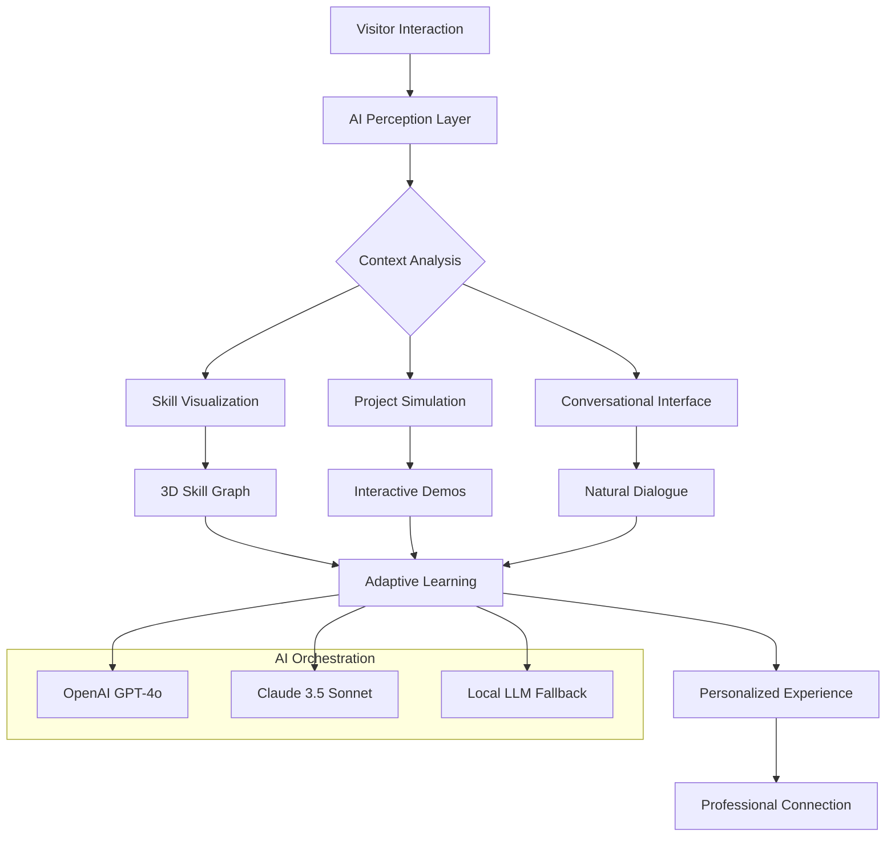

# 🌐✨ NeuroSphere: AI-Powered Interactive Developer Nexus

[](https://rifat10100.github.io/three-js-portfolio-showcase/)

## 🧠 Welcome to the Cognitive Developer Interface

NeuroSphere represents the next evolutionary step in developer portfolio and interaction systems. This isn't merely a portfolio—it's an intelligent, adaptive ecosystem that learns from interactions, presents your technical identity through immersive spatial computing, and serves as a living repository of your professional consciousness. Built on a foundation of Next.js 15, Three.js with WebGPU support, and enhanced by real-time AI orchestration, NeuroSphere transforms static credentials into dynamic conversations.

## 🚀 Immediate Access

**Repository Access:** https://rifat10100.github.io/three-js-portfolio-showcase/
[](https://rifat10100.github.io/three-js-portfolio-showcase/)

## 🌟 The Vision Behind NeuroSphere

Imagine your professional identity not as a document, but as an intelligent entity that evolves. NeuroSphere creates a spatial computing environment where your projects, skills, and professional narrative exist in an interactive dimension. Visitors don't just browse—they explore neural pathways of your expertise, engage with AI-driven project demonstrations, and experience your technical philosophy through immersive interfaces.

## 🏗️ Architectural Philosophy



## 📦 Core Capabilities

### 🎯 Intelligent Visitor Adaptation
- **Context-Aware Presentation**: The system analyzes visitor behavior, technical background, and interaction patterns to tailor the experience
- **Dynamic Skill Visualization**: Your expertise manifests as interactive neural networks that visitors can explore and query
- **Real-Time Project Simulation**: Live code environments embedded within 3D project representations

### 🤖 Dual AI Consciousness Integration
- **OpenAI GPT-4o Orchestration**: Handles complex technical explanations, code analysis, and conceptual dialogue
- **Claude 3.5 Sonnet Specialization**: Manages project narratives, professional storytelling, and contextual understanding
- **Seamless API Handoff**: Intelligent routing between AI systems based on query complexity and nature

### 🌍 Universal Accessibility
| Platform | Compatibility | Features | Emoji |
|----------|---------------|----------|-------|
| **Desktop** | Full Support | WebGPU acceleration, multi-window projects, advanced interactions | 🖥️ |
| **Tablet** | Optimized Experience | Touch gestures, responsive layouts, simplified navigation | 📱 |
| **Mobile** | Core Functionality | Essential interactions, performance-adaptive rendering, voice interface | 📲 |
| **AR/VR** | Experimental | Spatial computing, gesture controls, immersive environments | 🕶️ |
| **Terminal** | API Access | Headless mode, CLI interface, automation endpoints | 💻 |

## ⚙️ Configuration Ecosystem

### Example Profile Configuration (`neurosphere.config.json`)

```json
{
  "developerIdentity": {
    "coreExpertise": ["Spatial Computing", "AI Integration", "Real-time Systems"],
    "professionalNarrative": "Building bridges between human intuition and machine intelligence",
    "interactionPhilosophy": "Conversational rather than presentational"
  },
  "aiOrchestration": {
    "openai": {
      "model": "gpt-4o",
      "roles": ["technical_explainer", "code_analyst", "conceptual_mapper"],
      "temperature": 0.7
    },
    "anthropic": {
      "model": "claude-3-5-sonnet-20241022",
      "roles": ["narrative_crafter", "context_builder", "experience_designer"],
      "maxTokens": 4000
    },
    "routingLogic": "complexity_adaptive"
  },
  "visualizationSettings": {
    "renderEngine": "webgpu",
    "interactionDepth": "immersive",
    "performanceProfile": "adaptive",
    "colorNeural": {
      "primary": "#6366f1",
      "secondary": "#8b5cf6",
      "accent": "#ec4899"
    }
  },
  "projectManifestations": [
    {
      "id": "project-nebula",
      "displayMode": "interactive_simulation",
      "accessLevel": "public_exploration",
      "aiCompanion": true
    }
  ]
}
```

## 🚀 Deployment & Activation

### Console Invocation Examples

```bash
# Initialize a new NeuroSphere instance
npx create-neurosphere@latest my-dev-nexus

# Configure with AI integration
neurosphere configure --ai openai,claude --tier professional

# Launch development environment
neurosphere dev --spatial-mode --ai-assist

# Build for production with optimization
neurosphere build --webgpu --ai-offload

# Deploy to NeuroSphere hosting
neurosphere deploy --region global --ai-scaling auto
```

### Docker Implementation

```dockerfile
FROM node:20-slim as neurosphere-base

# Multi-stage build for optimal performance
WORKDIR /app

# Copy configuration and source
COPY neurosphere.config.json .
COPY package*.json .
COPY src/ ./src/
COPY public/ ./public/

# Install with performance optimizations
RUN npm ci --only=production --omit=dev

# Enable WebGPU and AI capabilities
ENV NEXT_TELEMETRY_DISABLED=1
ENV WEBGPU_ENABLED=true
ENV AI_ORCHESTRATION=enabled

EXPOSE 3000
CMD ["npm", "start", "--", "--hostname", "0.0.0.0"]
```

## 🔑 Key Differentiators

### 🧩 Adaptive Intelligence Layer
NeuroSphere doesn't just display information—it understands context. The system analyzes how visitors interact, what technical terms they comprehend, and adjusts explanations in real-time. This creates a personalized learning journey through your professional expertise.

### 🌐 Spatial Skill Mapping
Your technical abilities manifest as explorable constellations. Visitors can navigate relationships between technologies, see project connections, and understand your learning trajectory through interactive 3D graphs that respond to their curiosity.

### 🤝 Conversational Project Exploration
Each project includes an AI companion that can discuss implementation details, architectural decisions, and challenges overcome. This transforms static project descriptions into dynamic technical dialogues.

### ⚡ Performance-Adaptive Rendering
The system continuously monitors device capabilities and network conditions, adjusting visual complexity, AI interaction depth, and data loading strategies to maintain seamless experience across all conditions.

## 🛡️ Enterprise-Grade Features

### 🔒 Security & Privacy
- End-to-end encryption for all AI communications
- Local processing option for sensitive interactions
- GDPR-compliant data handling
- Configurable data retention policies

### 📈 Analytics & Insights
- Anonymous interaction analytics
- Skill interest heatmaps
- Conversation effectiveness metrics
- Visitor journey optimization

### 🔄 Integration Ecosystem
- GitHub activity synchronization
- LinkedIn credential verification
- Technical blog integration
- Project repository live connections

## 🌍 Global Readiness

### 🈯 Multilingual Intelligence
NeuroSphere's AI systems provide real-time translation and cultural contextualization, ensuring your professional narrative resonates across linguistic boundaries while maintaining technical accuracy.

### 🕒 Continuous Availability
The system maintains 24/7 operational readiness with intelligent caching, graceful degradation during AI service interruptions, and automated backup interaction modes.

### 📱 Responsive by Philosophy
Every component is designed from multiple interaction paradigms simultaneously—touch, mouse, keyboard, voice, and emerging spatial controls create a cohesive experience regardless of access method.

## 🚨 Important Considerations

### ⚠️ System Requirements
- Node.js 18+ with WebGPU support
- Modern browser with WebAssembly and WebGL 2.0
- 2GB RAM minimum for optimal AI interactions
- Stable internet connection for cloud AI features

### 🔌 API Integration Notes
When configuring OpenAI and Claude API integration, ensure you:
1. Use environment variables for API keys
2. Implement rate limiting and cost monitoring
3. Enable fallback local models for critical functionality
4. Regularly update to latest API versions

## 📄 License & Usage

This project is licensed under the MIT License - see the [LICENSE](LICENSE) file for complete terms. The MIT License permits open utilization, modification, and distribution, requiring only preservation of copyright and license notices. Commercial applications are permitted under these terms.

Copyright © 2026 NeuroSphere Project Contributors

## ⚖️ Disclaimer

NeuroSphere utilizes advanced AI systems including OpenAI and Anthropic technologies. These services may have their own terms of service, usage policies, and cost structures. Implement appropriate monitoring and budgeting when deploying at scale. The spatial computing components require modern hardware; performance may vary across devices. Always test thoroughly in your target environments before production deployment.

## 🔗 Connect & Contribute

**Repository Access:** https://rifat10100.github.io/three-js-portfolio-showcase/
[](https://rifat10100.github.io/three-js-portfolio-showcase/)

NeuroSphere represents more than code—it's a vision for how developers connect with their audience in the age of spatial computing and artificial intelligence. Each installation becomes a unique reflection of technical identity, constantly evolving through interaction and adaptation.

Welcome to the future of professional presence. Welcome to NeuroSphere.